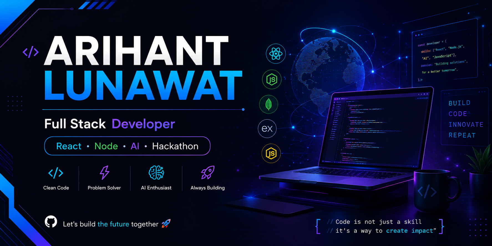

# 👋 Hi, I'm Arihant Lunawat

### 🚀 Full Stack Developer | AI Builder | Hackathon Enthusiast

Building modern web applications, learning AI, and solving real-world problems through code.

  

  

  

---

# 🚀 About Me

- 🌱 Currently Learning **Node.js, Express.js, MongoDB & AI**
- 💻 Frontend Developer using React & Tailwind CSS
- 🤖 Exploring Artificial Intelligence
- 🏆 Team Name: **Code X Indians**
- 🎯 Goal: Build products that solve real-world problems

---

# 🛠 Tech Stack

### Frontend

### Backend (Learning)

### Programming

### Tools

---

# 📂 Featured Projects

| Project | Description |
|---------|-------------|
| 🚀 Portfolio | Personal Portfolio Website |
| 🎨 UI Cards | Collection of Beautiful UI Components |
| ❤️ Love Calculator | Fun JavaScript Project |
| 📋 Task Nova | Productivity Web Application |
| 🤖 AI Project | Coming Soon |

---

# 📊 GitHub Stats

---

# 💻 Most Used Languages

---

# 🎯 2026 Goals

- ✅ Learn Backend Development
- ✅ Master AI APIs
- ✅ Build AI Products
- ✅ Participate in Multiple Hackathons
- ✅ Contribute to Open Source
- ✅ Build Startup-Level Projects

---

# 🌐 Connect With Me

---

### 💬 Favorite Quote

> **"First solve the problem. Then write the code."**

⭐ **If you like my work, consider following my GitHub profile!**

